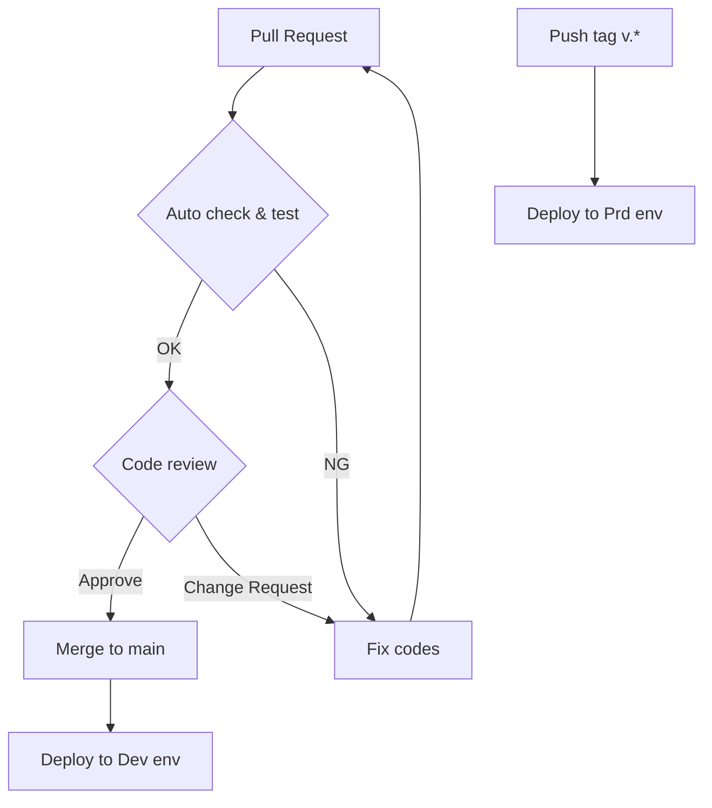

# mood-trend-terraform

`気分グラフ Mood Trend` の Firebase, Google Cloud 環境に対する IaC リポジトリです。

## Management Target

- Firebase Android App
- Firebase iOS App
- Google Cloud（Firebase 含む）IAM
- Firestore
  - DB
  - Collection / Document
  - Security Rules
- Cloud Storage for Firebase
  - Bucket
  - Security Rules
- Firebase Authentication
  - Anonymous Authentication

## File Organization

```plain
.
├── firebase_rules          
│   ├── firestore.rules     # Firestore に対するセキュリティルール定義
│   └── storage.rules       # Cloud Storage for Firebase に対するセキュリティルール定義
├── android.tf              # Firebase Android App 定義
├── authentication.tf       # Firebase Authentication 定義
├── backend.tf              # .tfstate 置き場定義
├── firestore.tf            # Firestore DB 定義
├── iam.tf                  # IAM 定義
├── ios.tf                  # Firebase iOS App 定義
├── locals.tf               # 固定値定義
├── main.tf                 # Firebase リソース定義
├── provider.tf             # Google Beta プロバイダ定義
└── storage.tf              # Cloud Storage for Firebase リソース定義
```

## Environments

Configuration Name|Platform|Connect to Firebase
--|--|--
app-dev|iOS / Android|[mood-trend-dev](https://console.firebase.google.com/u/0/project/mood-trend-dev/overview)
app-prod|iOS / Android|[mood-trend-prod](https://console.firebase.google.com/u/0/project/mood-trend-prod/overview)

## CI/CD Pipeline



## Other Repositories

- [mood-trend-flutter](https://github.com/Mood-Trend/mood-trend-flutter)
- [mood-trend-firebase](https://github.com/Mood-Trend/mood-trend-firebase)
- [mood-trend-snyk-scan](https://github.com/Mood-Trend/mood-trend-snyk-scan)
